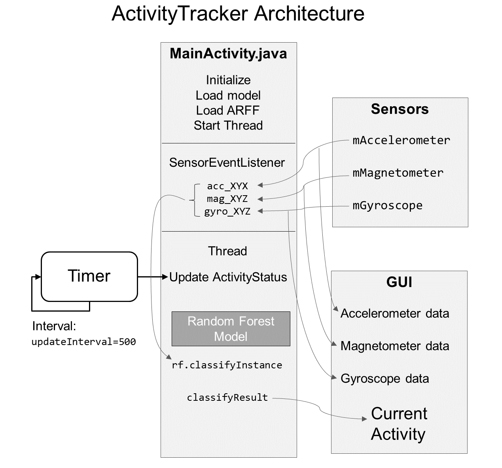
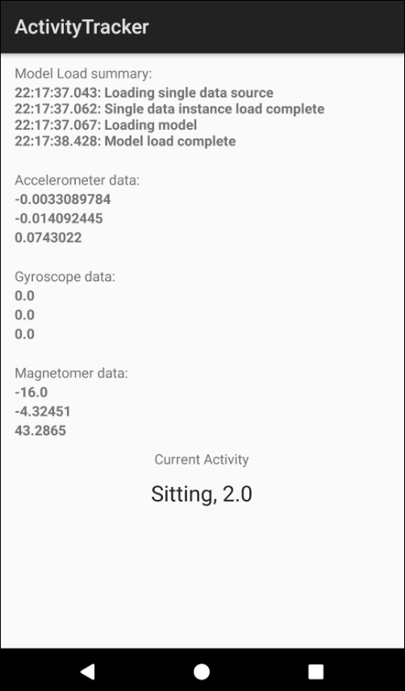

# Activity-Tracker
This project uses a trained model from the PAMAP2_dataset in conjunction with near real-time Android sensor data to determine the current activity of the device user. 

This project is covered in detail in chapter 6 of the [book](https://www.apress.com/us/book/9781484239506):

# About the Project

In this project, we are creating an Android application that uses the RF model together with the Android sensors to provide a near real-time prediction of the current activity of the user.

The app shows a real-time readout of the current sensor values for the accelerometer, gyroscope, and magnetometer. At the bottom of the screen, the app shows the current activity and the current activity ID, an integer between 1 and 12. As you monitor the app, you will see the sensor values update in real-time, while the current activity updates twice per second.

In the project, we will use the data collected for the PAMAP2_Dataset. The cleaned data we used to build our model contained accelerometer, gyroscope, and magnetic field data. The units of measure used by the original collection devices matches the Android sensor units, so no conversion is necessary.

# Project References

Project Name: **Activty Tracker**

Source: **ActivityTracker.zip** or **github.com/wickapps/Activity-Tracker**

Type: **Android Studio Project**

# File Description

| File | Description |
| --- | --- |
| app->libs->Weka-Android-3-8-1.jar | The Weka API library file for Android. |
| app->src->main->java->MainActivity.java | The main application source code is included in this single file. |
| app->src->main->res->layout->activity_main.xml | The main GUI layout file for the application. |
| app->src->main->res->raw->rf_i10_cross.model | The RF model used by the application to make predictions. |
| app->src->main->res->raw->subject101_single.arff | The single instance ARFF file used by the application to setup the data attribute properties. |

# Application Architecture

# Application Screenshot
